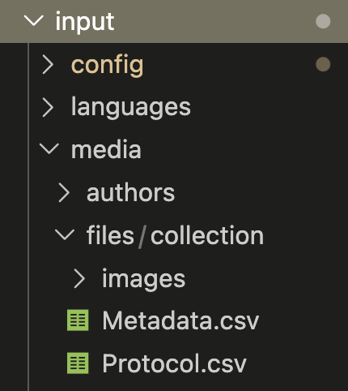

# Mirla


Mirla es un sistema diseñado para transformar sitios web estáticos (creados con Publii) en colecciones y exhibiciones digitales interactivas y publicaciones crossmedia (simultáneamente en línea e imprimibles). Está compuesto por un *tema*, que contiene el estilo, las páginas base y componentes interactivos, y por un *plugin*, que transforma y estructura los datos y crea páginas individuales para los elementos de la colección.

Sigue esta guía para instalar el *tema*, estructurar los datos de tu colección, configurar el *plugin* y usar los componentes interactivos personalizados de Mirla en tus páginas. Para lograr todo esto debes tener Publii instalado previamente y debes haber creado un sitio al que integrarás el sistema de Mirla. Puedes construir el sitio web con normalidad e incluir menús, páginas, posts, autores, etc. de la forma convencional en la que se trabaja en Publii.

- [Mirla](#mirla)
  - [Instalar el tema](#instalar-el-tema)
  - [Colecciones digitales](#colecciones-digitales)
    - [1. Preparar los archivos de tu colección](#1-preparar-los-archivos-de-tu-colección)
      - [A. `Protocol.csv`](#a-protocolcsv)
      - [B. `Metadata.csv`](#b-metadatacsv)
      - [C. La carpeta de imágenes (`Images`)](#c-la-carpeta-de-imágenes-images)
      - [D. Otros medios](#d-otros-medios)
    - [2. Instalar y configurar el plugin](#2-instalar-y-configurar-el-plugin)
      - [Instalación](#instalación)
      - [Crear la plantilla de ítem](#crear-la-plantilla-de-ítem)
      - [Configurar el plugin](#configurar-el-plugin)
    - [3. Uso de los componentes interactivos de Mirla](#3-uso-de-los-componentes-interactivos-de-mirla)
      - [Visualizaciones de Datos](#visualizaciones-de-datos)
      - [Componentes narrativos](#componentes-narrativos)
      - [Componentes de gestión de datos](#componentes-de-gestión-de-datos)
    - [Solución de problemas comunes](#solución-de-problemas-comunes)
  - [Publicaciones crossmedia](#publicaciones-crossmedia)

---

## Instalar el tema
El tema de Mirla proporciona la base de estilos necesaria, modos claro/oscuro (a través de PicoCSS) y las plantillas de página especializadas que se requieren para que la colección y los posts crossmedia se visualicen correctamente. Para instalar el tema sigue estas instrucciones:

1. En el repositorio, en la sección de releases, descarga el archivo `.zip` del tema de Mirla (mirlaTheme).
2. En Publii, haz clic en el **menú de tres puntos** en la esquina superior derecha.
3. Selecciona **Themes** (Temas) > **Install Theme** (Instalar tema) y selecciona el archivo `.zip`.
4. Ve a la configuración de tu sitio (Site settings) y selecciona el tema Mirla como tu tema activo.
5. Ve a la configuración del tema (Theme) y configura el aspecto y otros elementos del tema con normalidad: modo claro/oscuro, color de acento (Color Version), favicon, logo, fuentes personalizadas, etc.

---

## Colecciones digitales

### 1. Preparar los archivos de tu colección
Todos los datos y archivos multimedia de tu colección deben ponerse en la carpeta `input/media/files/collection` dentro de la carpeta de tu sitio en Publii. Los datos deben estar organizados exactamente de la siguiente manera:

#### A. `Protocol.csv`
Este archivo funciona como protocolo que define los atributos de los ítems de tu colección. Debe contener exactamente dos encabezados: `Attribute` y `Type` (escritos exactamente así). Cada fila define un campo de metadatos y le indica a Mirla cómo mostrarlo en la tabla de metadatos del elemento.

Los Tipos (**Types**) disponibles incluyen:
* **`pid`**: (Obligatorio) El Identificador Persistente único para el elemento.
* **`label`**: (Obligatorio) El título o nombre legible para humanos del elemento.
* **`text`**: Cadenas de texto estándar.
* **`number`**: Valores numéricos (ej. precios, cantidades).
* **`date`**: Datos cronológicos (años o fechas completas).
* **`link`**: URLs externas o internas.
* **`youtube`**: Un ID de video de YouTube o URL para incrustar.
* **`image` / `video` / `audio`**: Archivos multimedia asociados con el elemento.
* **`ref`**: Referencias o enlaces cruzados a otros elementos dentro de la colección (pids separados por comas).
* **`latlong`**: Coordenadas geográficas formateadas como `"latitud, longitud"` (ej. `"4.7110, -74.0721"`). Se usa para mapas.

#### B. `Metadata.csv`
Esta es la hoja de cálculo maestra que contiene los datos de tu colección, una fila para cada ítem de la colección.

* Los encabezados de este CSV **deben coincidir exactamente** con los nombres de la columna `Attribute` definidos en tu `Protocol.csv` (ten cuidado con las mayúsculas/minúsculas y los espacios al final).
* Los campos `pid` y `label` son estrictamente obligatorios para cada elemento.
* Si los encabezados no coinciden, la generación de las páginas individuales de los elementos fallará.

#### C. La carpeta de imágenes (`Images`)
Esta carpeta contiene los recursos visuales para cada elemento de la colección.

* **Imágenes individuales:** Coloca archivos `.jpg` o `.png` individuales nombrados exactamente igual que el PID del elemento (ej. `item001.jpg`).
* **Múltiples imágenes:** Crea una subcarpeta nombrada exactamente igual que el pid del elemento (ej. una carpeta llamada `item001`). Coloca todas las imágenes dentro de esta carpeta. Se mostrarán en la galería del elemento en orden alfabético.

#### D. Otros medios
* Como es posible incluir múltiples tipos de medios (como audio y video) en las tablas de metadatos, estos archivos multimedia deben colocarse directamente en la carpeta principal `collection`, preferiblemente en una subcarpeta, aunque **no** en la carpeta de imágenes. Asegúrate de que los nombres de los archivos correspondan exactamente a lo que referencias en tus metadatos (relativo a la carpeta collection).

Así se debe ver la estructura de archivos de la colección:



---

### 2. Instalar y configurar el plugin 
El plugin Mirla Collection Generator lee tus archivos CSV, construye una api consumible por los elementos interactivos y genera automáticamente páginas individuales con visores de imágenes y tablas de metadatos para cada elemento de la colección.

#### Instalación
1. Descarga el archivo `.zip` del plugin Mirla Collection Generator.
2. En Publii, haz clic en el **menú de tres puntos** en la esquina superior derecha.
3. Selecciona **Plugins** > **Install Plugin** (Instalar plugin) y selecciona el archivo `.zip`.
4. Regresa a la ventana principal de Publii.

#### Crear la plantilla de ítem
Para que el plugin funcione, necesita una página de plantilla de ítem que servirá de base para la presentación de las páginas de los ítems de la colección.

1. Crea una nueva página (post) en Publii. Dale un nombre administrativo claro (ej. "Página plantilla de ítem").
2. En la barra lateral derecha, baja hasta **Other Options** (Otras opciones).
3. En **Template** (Plantilla), selecciona **Collection Item Template**.
4. Haz clic en **Publish** (Publicar) en la página. *(Nota: No es necesario agregar esta página a los menús de navegación de tu sitio, pero debe estar publicada para que el plugin funcione).*
5. Regresa a la ventana principal de Publii.

#### Configurar el plugin
1. Ve a **Tools & Plugins** (Herramientas y Plugins) en la barra lateral izquierda.
2. Haz clic en el interruptor para activar el **Mirla Collection Generator**, luego haz clic en su logo para abrir la configuración.
3. Configura las tres opciones principales:
   * **Item Template Page:** Selecciona la "Página plantilla de ítem" que acabas de crear.
   * **Excluded Metadata:** Enumera los nombres de los atributos de tu CSV que *no* deseas que sean visibles para el público (ej. `pid`, notas internas).
   * **Gallery Filters:** Enumera los atributos que deseas que los usuarios puedan filtrar en la barra de búsqueda principal de la colección (ej. `Categoría`, `Año`, `Autor`).
4. Haz clic en **Save** (Guardar) para guardar tu configuración.

Ahora, cada vez que previsualices tus cambios o sincronices tu sitio web, el plugin generará las páginas de los elementos basándose en tus CSVs. Si ocurre un error, revisa el mensaje de error para encontrar pistas sobre cómo solucionarlo.

---

### 3. Uso de los componentes interactivos de Mirla
Mirla viene con un conjunto de componentes web personalizados que puedes insertar directamente en tus páginas para crear exhibiciones interactivas.

Para usarlos, abre una página en Publii, abre la vista de **Código Fuente** (Source Code) en el editor (el botón `<>`), y pega las etiquetas HTML. Cuando regreses al editor visual, verás una caja estilizada que sirve como marcador de posición.

*(Nota: ¡Todos los componentes se conectan automáticamente a los datos de tu `Metadata.csv` y cambian de color fluidamente entre el Modo Oscuro y Claro!)*

#### Visualizaciones de Datos
Al hacer clic en los puntos de datos dentro de estas visualizaciones, se abrirá automáticamente una galería detallada con los elementos asociados.

**1. Gráfico de Barras (Bar Chart)**
Muestra las categorías principales de tu colección.
```html
<mirla-barchart key="Categoría" top="10"></mirla-barchart>
```
* `key`: La columna de tu CSV por la cual agrupar.
* `top`: Limita el gráfico al top X de resultados (opcional).

**2. Gráfico de Waffle (Waffle Chart)**
Una cuadrícula de 10x10 que visualiza las categorías proporcionalmente, ideal para hacer un sobrevuelo de la composición de la colección.
```html
<mirla-waffle key="Categoría"></mirla-waffle>
```
* `key`: La columna de tu CSV por la cual agrupar.

**3. Línea de Tiempo (Timeline)**
Grafica elementos a lo largo de una línea de tiempo horizontal.
```html
<mirla-timeline datekey="Año"></mirla-timeline>
```
* `date-key`: La columna que contiene tus datos cronológicos (ej. `1998` o `1998-05-12`).

**4. Árbol / Dendrograma (Tree)**
Un árbol jerárquico que muestra cómo las categorías se desglosan en subcategorías.
```html
<mirla-tree keys="Categoría, Técnica, Año"></mirla-tree>
```
* `keys`: Una lista separada por comas de columnas que establecen la jerarquía (de padre a hijo).

**5. Gráfico de Red (Network Graph)**
Un lienzo interactivo basado en física que muestra las conexiones entre entidades.
```html
<mirla-network sourcekey="Autor" targetkey="Movimiento"></mirla-network>
```
* `source-key` y `target-key`: Las dos columnas que establecen las relaciones (ej. Autores y los Movimientos artísticos a los que pertenecen).

**6. Mapa Geográfico (Geographic Map)**
Un mapamundi interactivo que ubica tus elementos por su ubicación geográfica.
```html
<mirla-map coordkey="latlong"></mirla-map>
```
* `coord-key`: La columna que contiene tus cadenas de `"latitud, longitud"`.

---

#### Componentes narrativos
Usa estos para incrustar elementos específicos de la colección directamente en el flujo de tu redacción.

**7. Tarjeta de Vista Previa (Item Preview Card)**
Incrusta una tarjeta de vista previa limpia y en la que se puede hacer clic para un elemento específico.
```html
<mirla-preview pid="item001" title="Un artefacto único" page="1"></mirla-preview>
```
* `pid`: El ID del elemento a mostrar.
* `title`: Leyenda personalizada opcional.
* `page`: Qué imagen de la carpeta del elemento mostrar (por defecto es `1`).

**8. Minigalería en Línea (Inline Mini-Gallery)**
Crea una galería estilo mampostería (*masonry*) de elementos que coinciden con un criterio específico.
```html
<mirla-gallery key="Movimiento" value="Fluxus" limit="6"></mirla-gallery>
```
* `key`: La columna de metadatos a buscar.
* `value`: El valor específico con el que debe coincidir.
* `limit`: Número máximo de elementos a mostrar (opcional).

**9. Deslizador de Comparación de Imágenes (Comparison Slider)**
Un deslizador interactivo de "Antes y Después". Perfecto para mostrar restauración de archivos, múltiples capas o contrastar dos elementos diferentes.
```html
<mirla-compare pid1="item001" pid2="item002" label1="Rayos X" label2="Luz Visible"></mirla-compare>
```
* **Para comparar dos imágenes del MISMO elemento:** Solo proporciona `pid1`. Automáticamente usará la Imagen 1 y la Imagen 2 de la carpeta de ese elemento.
* **Para comparar dos elementos DIFERENTES:** Proporciona tanto `pid1` como `pid2`. Usará la primera imagen de cada uno.
* `label1` / `label2`: Las etiquetas de texto que aparecen en los lados izquierdo y derecho del deslizador.

---

#### Componentes de gestión de datos

**10. Tabla de Metadatos (Metadata Table)**
Una cuadrícula de datos de toda tu colección que se puede buscar, ordenar y descargar.
```html
<mirla-table title="Archivo de la Colección" excludedkeys="latlong, _resena"></mirla-table>
```
* `title`: El título que se muestra arriba de la tabla (opcional).
* `excluded-keys`: Una lista separada por comas de columnas de metadatos para ocultar de la vista pública (opcional).

---

### Solución de problemas comunes

Trabajar con datos estructurados requiere precisión. Si algo no se renderiza correctamente, generalmente se debe a un pequeño error tipográfico o un archivo mal ubicado. Aquí están los problemas más comunes y cómo solucionarlos:

**1. "¡Las páginas de mis elementos no se generan en absoluto!"**
* **Revisa tu Página plantilla de ítem:** ¿Recordaste hacer clic en "Publicar" en tu Página Base en Publii? El plugin no puede usarla si está guardada como borrador.
* **Revisa tus Encabezados:** Abre `Protocol.csv` y `Metadata.csv`. Los nombres de las columnas deben coincidir *exactamente*. "Categoría" no es lo mismo que "categoria" o " Categoría " (ten cuidado con los espacios en blanco accidentales al final de la palabra).
* **Revisa los Campos Obligatorios:** Cada fila en tu `Metadata.csv` debe tener un `pid` (identificador persistente) y un `label`. Si a una fila le falta un PID, el generador fallará.

**2. "La página del elemento se generó, pero faltan las imágenes."**
* **Nombres de Carpetas:** Si estás usando una carpeta para múltiples imágenes, el nombre de la carpeta debe ser el PID *exacto* del elemento.
* **Nombres de Imágenes Individuales:** Si estás usando un solo archivo, debe llamarse `[pid].jpg` o `[pid].png`.
* **Ubicación:** Asegúrate de que tus imágenes estén dentro de `input/media/files/collection/images/[pid]` y no flotando en otro lugar en el administrador de medios de Publii.

**3. "Pegué un componente visualizador en mi artículo, pero aparece completamente en blanco."**
* **Falta de Coincidencia de la Clave (Key):** Si escribiste `<mirla-barchart key="Author"></mirla-barchart>`, pero tu columna del CSV se llama `Autores`, el gráfico encontrará cero datos y colapsará. El atributo `key` debe coincidir exactamente con el encabezado del CSV.
* **Datos Vacíos:** Asegúrate de que los elementos realmente tengan datos en la columna que intentas visualizar.
* **Comillas en HTML:** Asegúrate de usar comillas rectas (`" "`) alrededor de tus atributos HTML, no comillas curvas/inteligentes (`“ ”`) que algunos procesadores de texto insertan automáticamente.

**4. "El componente de Mapa no está ubicando mis puntos."**
* Revisa el formato de tus coordenadas: latitud y longitud en formato decimal, no grados, minutos y segundos. Tu columna de mapeo debe contener ambos números separados por una coma como una sola cadena de texto (ej. `4.7110, -74.0721`). Si una celda solo dice `Bogotá`, el mapa no sabrá cómo graficarlo.

**5. "El Deslizador de Comparación no muestra las imágenes."**
* El deslizador de comparación requiere al menos dos imágenes para funcionar. Si solo pasas un PID (`pid1="item001"`), la carpeta de ese elemento específico *debe* contener al menos dos imágenes. Si solo tiene una, el componente mostrará un mensaje de error.

**6. "El plugin no reconoce los metadatos."**
* Asegúrate de que el software que utilizaste para construir la tabla `Metadata.csv` en efecto exporta una tabla de columnas separadas por comas. Excel en español suele separar las columnas por punto y coma, lo que rompe el formato y produce errores. Recomiendo usar programas consistentes, como Google Sheets u Onlyoffice.

**7. "La visualización no cuenta los datos de manera correcta."**
* Al construir tu `Metadata.csv`, intenta mantener la consistencia en tus valores categóricos. Los visualizadores tratan `"Impresión"`, `"impresión"`, y `"Impresión "` como tres categorías completamente diferentes. ¡Usar un programa de hojas de cálculo para gestionar tus CSVs antes de ponerlos en la carpeta `collection` puede ayudarte a detectar estas inconsistencias a tiempo!

## Publicaciones crossmedia

(Documentación en proceso... :pray:)